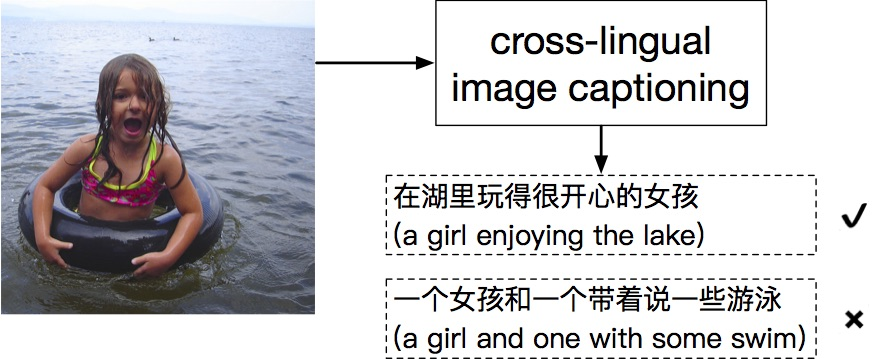

# Cross-Lingual Image Captioning

Image captioning has so far been explored mostly in English, as most available datasets are in this language. However, the application of image captioning should not be restricted by language. The study of cross-lingual image captioning is essential for a large population on the planet who cannot speak English. We are developing novel algorithms that enable learning an image captioning model for a target language other than English, with minimal labeling effort.

## Code

* [Fluent-cap: Fluency-guided image captioning](https://github.com/weiyuk/fluent-cap)

## Datasets

* [Flickr8k-cn (59MB)](http://lixirong.net/data/mm2017/flickr8k-cn.tar.gz)
* [Flickr30k-cn (236MB)](http://lixirong.net/data/mm2017/flickr30k-cn.tar.gz)
* [COCO-CN](https://github.com/li-xirong/coco-cn/)

|  | Flickr8k-cn |||  Flickr30k-cn ||| COCO-CN ||| 
|:--- | -----:| -----:| -----:| -----:| -----:| -----:| -----:| -----:| -----:|
|        | train| val | test | train | val | test | train | val | test |
| Images | 6,000 | 1,000 | 1,000| 29,783 | 1,000 | 1,000| 18,341 | 1,000  | 1,000 |
| Human-annotated   Chinese sentences      | 30,000 | 5,000 | 5,000 |  -- | -- |  --  |  20,065 | 1,100 |  1,053  |
| Machine-translated   Chinese sentences | 30,000 | 5,000 | -- | 148,915 | 5,000 | -- | 91,758 | 5,004 | 5,001 | 
| Human-translated   Chinese sentences   | --     | --    | 5,000 |  -- | -- | 5,000| -- | -- | 5,000|

#### Performance table

Automated evaluation of five approaches to cross-lingual image captioning. Rejection sampling and weighted loss are comparable to *Without fluency* which learns from the full set of machine-translated sentences.

|  | Flickr8k-cn |||  Flickr30k-cn |||
|:--- | -----:| -----:| -----:| -----:| -----:| -----:|
|        | BLEU-4| ROUGE | CIDEr | BLEU-4| ROUGE | CIDEr
| Late translation  | 17.3 | 39.3 | 33.7 | 15.3 | 38.5 | 27.1 |
| Without fluency   | 24.1 | 45.9 | 47.6 | 17.8 | 40.8 | 32.5 |
| Fluency-only      | 20.7 | 41.1 | 35.2 | 14.5 | 35.9 | 25.1 |
| Rejection sampling| 23.9 | 45.3 | 46.6 | 18.2 | 40.5 | 32.9 |
| Weighted loss     | 24.0 | 45.0 | 46.3 | 18.3 | 40.2 | 33.0 |

## Pre-trained Models

[ruc_imcap](pretrained): generate Chinese captions for novel images using one script

## Publications

1. Xirong Li, Weiyu Lan, Jianfeng Dong, Hailong Liu, [Adding Chinese Captions to Images](https://doi.org/10.1145/2911996.2912049), ACM ICMR 2016
2. Qijie Wei, Xiaoxu Wang, Xirong Li, [Harvesting Deep Models for Cross-Lingual Image Annotation](https://doi.org/10.1145/3095713.3095751), CBMI 2017
3. Weiyu Lan, Xirong Li, Jianfeng Dong, [Fluency-Guided Cross-Lingual Image Captioning](https://doi.org/10.1145/3123266.3123366), ACM MM 2017
4. 蓝玮毓, 王晓旭, 杨刚, 李锡荣, [标签增强的中文看图造句 (Improving Chinese Image Captioning by Tag Prediction)](http://cjc.ict.ac.cn/online/onlinepaper/lwy-201916191641.pdf), 计算机学报 (Chinese Journal of Computers), volume 42, number 1, pages 136-148, 2019 (2017中国多媒体大会优秀论文奖)
5. Xirong Li, Chaoxi Xu, Xiaoxu Wang, Weiyu Lan, Zhengxiong Jia, Gang Yang, Jieping Xu, [COCO-CN for Cross-Lingual Image Tagging, Captioning and Retrieval](https://github.com/li-xirong/coco-cn), IEEE Transactions on Multimedia, Volume 21, Number 9, pages 2347-2360, 2019
6. Zhengxiong Jia, Xirong Li, [iCap: Interactive Image Captioning with Predictive Text](http://lixirong.net/pub/icmr2020-icap.pdf), ACM ICMR 2020
7. Aozhu Chen, Xinyi Huang, Hailan Lin, Xirong Li, [Towards Annotation-Free Evaluation of Cross-Lingual Image Captioning](http://lixirong.net/pub/mmasia2020-eval-cap.pdf), ACM MMAsia 2020

## Acknowledgements

This project was supported by the National Natural Science Foundation of China (No. 61672523).
